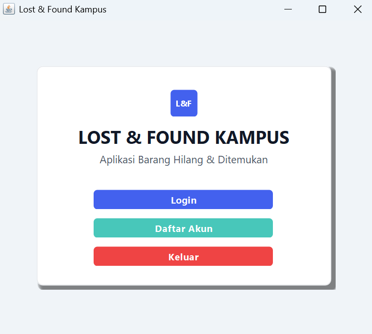
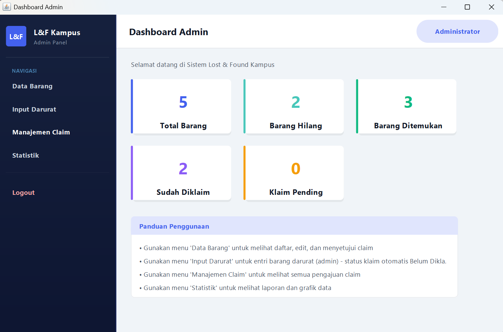
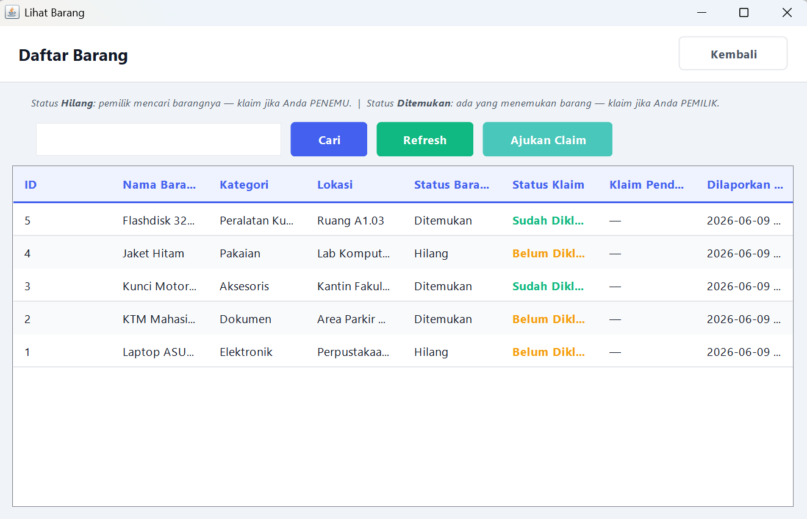
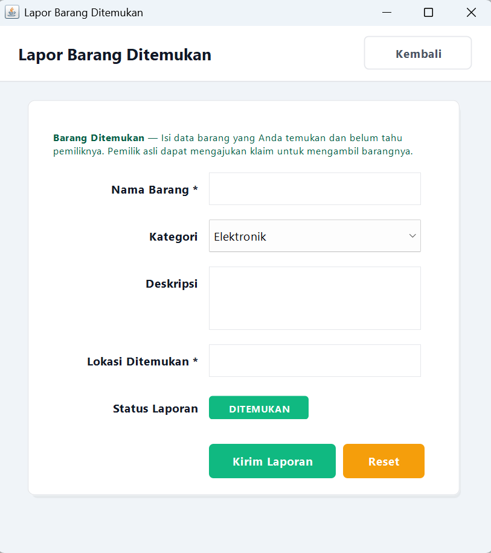
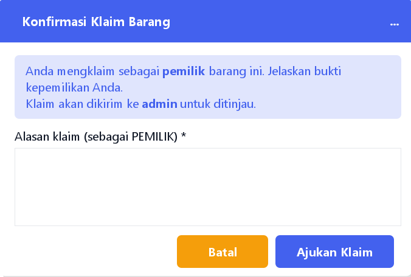
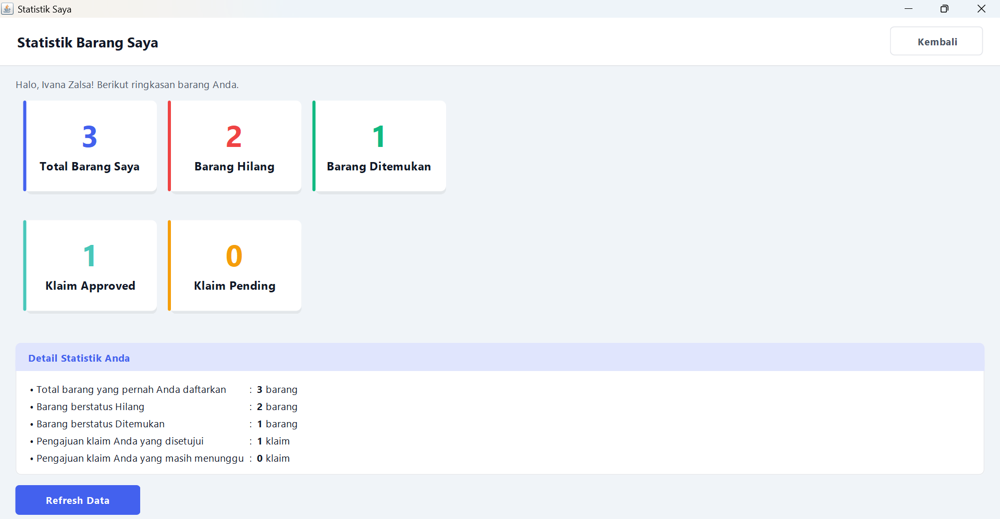

# Lost & Found Campus

A campus Lost & Found information system for reporting, searching, and claiming lost or found items.

## About

Lost & Found Campus is a desktop-based information system designed to help campus users report lost or found items, search for reported items, and submit claims for items they believe belong to them.

The system provides different features for users and administrators to support the management of lost and found items on campus.

## Features

### User
- Login and registration
- View dashboard
- Report lost or found items
- View reported items
- Search for items
- Submit item claims
- View claim history
- View item details
- View user statistics

### Admin
- View admin dashboard
- Manage reported items
- Add and edit item data
- Manage claim requests
- View statistics

## Technologies

- Java
- Maven
- NetBeans
- MySQL
- MVC Architecture

## Application Screenshots

### Login


### User Dashboard


### Admin Dashboard


### Item List


### Report Item


### Claim Item


### Statistics


## Project Structure

```text
LostFoundCampus/
├── nbproject/
├── screenshots/
├── src/
│   ├── Controller/
│   ├── Model/
│   ├── View/
│   └── Main.java
├── .gitignore
└── pom.xml
